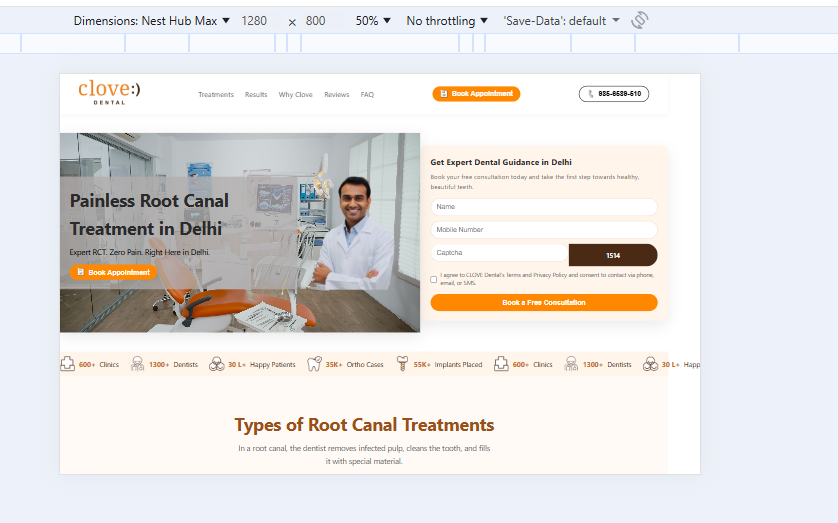
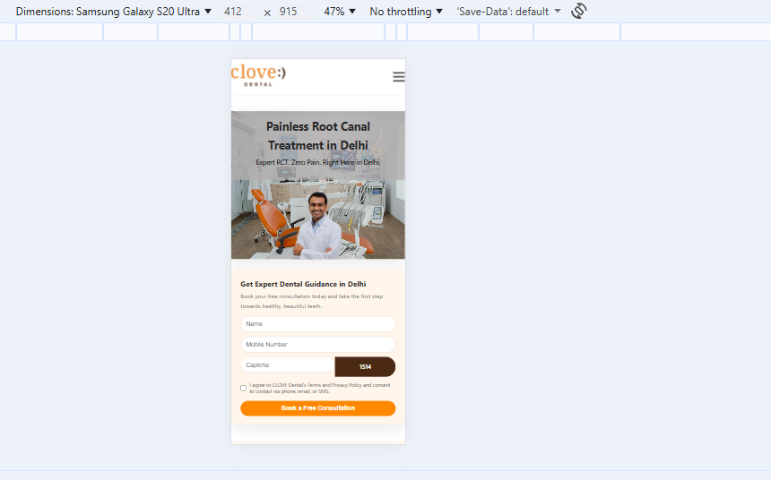
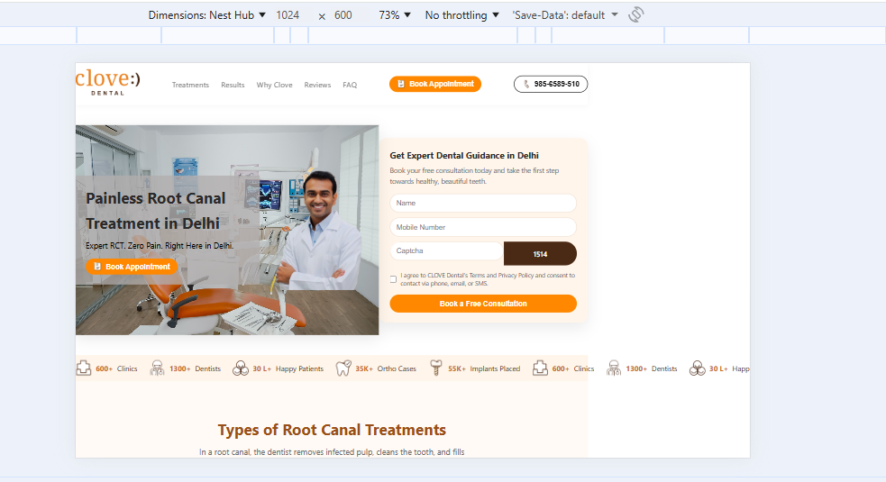

# Clove Dental Landing Page

A responsive landing page for Clove Dental, built from a Figma design using HTML, CSS, and Vanilla JavaScript.

## 🚀 Live Demo

[View Live Site](https://yourusername.github.io/clove-dental-landing-page) _(Replace with your deployed URL)_

## 📋 Project Overview

This project is a pixel-perfect, fully responsive landing page for Clove Dental, India's leading dental care brand. The page showcases various dental treatments, patient testimonials, and clinic information.

### Features

- **Fully Responsive Design**: Works perfectly on mobile, tablet, and desktop
- **Interactive Elements**: Mobile hamburger menu, smooth scrolling, back-to-top button
- **Modern UI**: Clean design with custom CSS properties and smooth animations
- **Semantic HTML**: Proper structure for accessibility and SEO
- **Vanilla JavaScript**: No frameworks used, pure JavaScript for interactivity

### Sections Included

1. **Header** - Navigation with mobile menu
2. **Hero** - Main banner with form and background image
3. **Stats** - Key statistics and achievements
4. **Treatments** - Root canal treatment options
5. **Results** - Before/after patient images
6. **Why Choose** - Feature list with expandable items
7. **Reviews** - Patient testimonials
8. **Footer** - Contact information and links

## 🛠️ Technologies Used

- **HTML5** - Semantic markup
- **CSS3** - Custom properties, Flexbox, Grid, responsive design
- **Vanilla JavaScript** - DOM manipulation, event handling

## 📁 Project Structure

```
clove-dental-landing-page/
├── index.html              # Main HTML file
├── css/
│   └── style.css           # All styles
├── js/
│   └── script.js           # JavaScript functionality
├── images/                 # All images and assets
├── favicon.ico/            # Favicon
└── README.md               # Project documentation
```

## 🚀 Getting Started

### Prerequisites

- A modern web browser (Chrome, Firefox, Safari, Edge)
- VS Code or any code editor
- Git for version control

### Installation

1. **Clone the repository**

   ```bash
   git clone https://github.com/yourusername/clove-dental-landing-page.git
   cd clove-dental-landing-page
   ```

2. **Open in browser**
   - Open `index.html` in your web browser
   - Or use a local server for better experience

### Development

1. **Make changes** to HTML, CSS, or JS files
2. **Test responsiveness** using browser dev tools
3. **Commit changes** and push to GitHub

## 📱 Responsive Breakpoints

- **Mobile**: < 768px
- **Tablet**: 768px - 1024px
- **Desktop**: > 1024px

## 🎨 Design Features

- **Color Scheme**: Orange (#c76a2a) and cream (#fffaf5) theme
- **Typography**: System fonts for optimal performance
- **Animations**: Smooth transitions and hover effects
- **Accessibility**: Proper alt texts, ARIA labels, semantic HTML

## 📸 Screenshots

### Desktop View


_Add your desktop screenshot here_

### Mobile View



### Tablet View



## 🔧 Customization

### Changing Colors

Edit the CSS custom properties in `css/style.css`:

```css
:root {
  --primary: #c76a2a; /* Main orange color */
  --primary-dark: #9a4f18; /* Darker orange */
  --accent: #ffb36b; /* Light orange */
  --bg: #fffaf5; /* Cream background */
  --text: #2a2a2a; /* Dark text */
  --muted: #6b6b6b; /* Gray text */
}
```

### Adding New Sections

1. Add HTML structure in `index.html`
2. Style in `css/style.css`
3. Add interactivity in `js/script.js` if needed

## 🚀 Deployment

### GitHub Pages (Free & Easy)

1. **Push to GitHub**

   ```bash
   git add .
   git commit -m "Initial commit"
   git push origin main
   ```

2. **Enable GitHub Pages**

   - Go to repository Settings → Pages
   - Select "main" branch and "/ (root)" folder
   - Save and wait 1-2 minutes

3. **Update README** with live URL

### Other Options

- **Vercel**: Drag & drop the folder
- **Netlify**: Connect GitHub repository
- **Firebase**: Use Firebase Hosting

## 📝 Scripts

The JavaScript handles:

- Mobile menu toggle
- Smooth scrolling for anchor links
- Back-to-top button functionality

## 🤝 Contributing

1. Fork the repository
2. Create a feature branch (`git checkout -b feature/amazing-feature`)
3. Commit changes (`git commit -m 'Add amazing feature'`)
4. Push to branch (`git push origin feature/amazing-feature`)
5. Open a Pull Request

## 📄 License

This project is for educational purposes. Feel free to use and modify.

## 🙏 Acknowledgments

- Design inspiration from Figma community
- Icons and images from Clove Dental assets
- Built as part of Unbundl assignment

## 📞 Contact

+917223918402
For questions or feedback:

- Email: ansarishufiyan@gmail.com
- GitHub: (https://github.com/Ansari-12)
